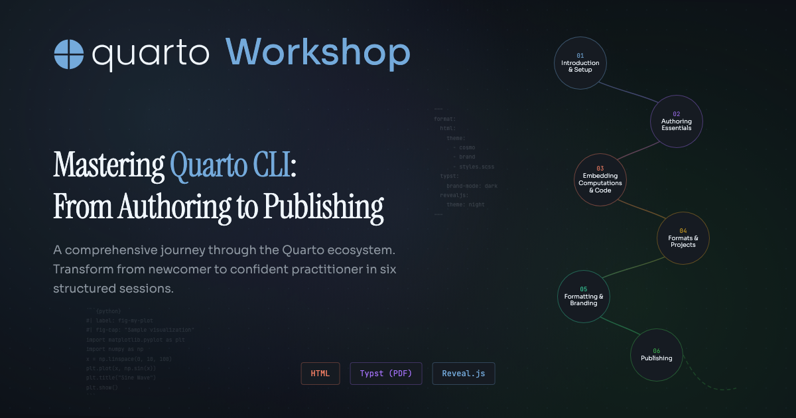

# Mastering Quarto CLI: From Authoring to Publishing



A comprehensive workshop providing an immersive journey through the Quarto ecosystem, designed to transform participants from newcomers to confident practitioners capable of creating sophisticated, reproducible documents and interactive publications.

_This workshop was created for [Physalia Courses](https://www.physalia-courses.org/)._

Website: <https://m.canouil.dev/mastering-quarto-cli/>

[](https://codespaces.new/mcanouil/mastering-quarto-cli?quickstart=1&devcontainer_path=.devcontainer%2Fdevcontainer.json)

## Sessions

The workshop is structured into seven sessions across two parts.

### Part 1

1. **Introduction & Setup** -- Quarto fundamentals, installation, project types, and the command-line interface.
1. **Authoring Essentials** -- Markdown fundamentals, Quarto-specific features, and YAML configuration.
1. **Embedding Computations & Code** -- Integrating R, Python, and Julia code with execution control and caching strategies.

### Part 2

1. **Formats & Projects** -- Advanced project structures and multi-format optimisation.
1. **Formatting & Branding** -- Bootstrap theming, `brand.yml` systems, and Pandoc templating.
1. **Publishing** -- Deploying through Posit Connect Cloud, GitHub Pages, and automated workflows.
1. **Closing & Next Steps** -- Recap and further resources.

## Prerequisites

- [Quarto CLI](https://quarto.org/docs/get-started) 1.8 or higher.
- One or more computing languages:
  - [R](https://cran.r-project.org) 4.5 or higher.
  - [Python](https://www.python.org/downloads/) 3.13 or higher.
  - [Julia](https://julialang.org/downloads/) 1.12 or higher.

Alternatively, use GitHub Codespaces (badge above) and run the setup script:

```bash
./.devcontainer/setup.sh --what <all|r|python|julia>
```

## License

This project is licensed under the [CC BY-NC-SA 4.0](LICENSE) licence.
