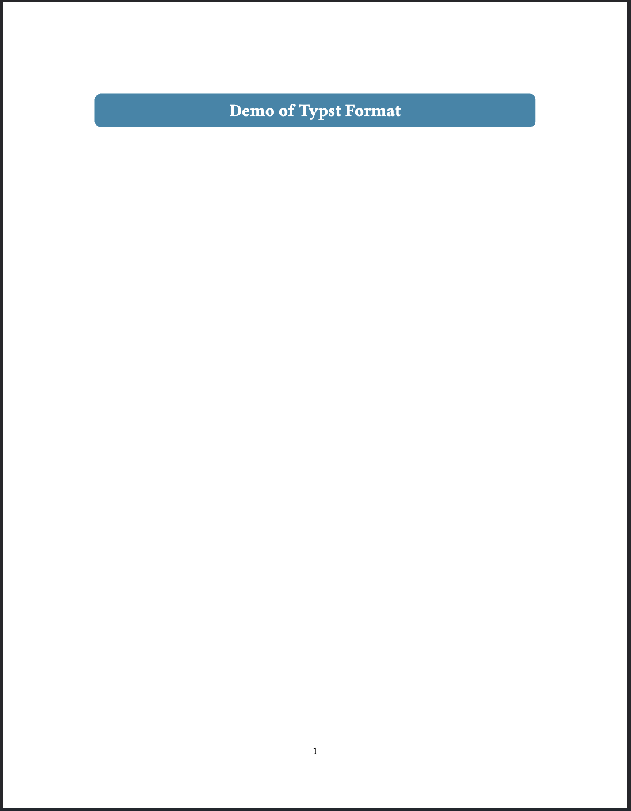

# Session Overview



## Session Objectives

This session explores Quarto's branding capabilities, focusing on `brand.yml` as the central tool for unified branding across formats, the `brand.yml` R and Python packages for applying brand guidelines in code outputs, packaging brand configurations as extensions, and importing them with `quarto use brand`.

## Learning Objectives

::: {.fragment fragment-index="1"}

By the end of this session, participants will be able to:

:::

- [Create unified branding across multiple output formats using `brand.yml`.]{.fragment fragment-index="2"}
- [Use the `brand.yml` R and Python packages to apply brand guidelines in code outputs.]{.fragment fragment-index="3"}
- [Develop brand extensions for organisational reuse.]{.fragment fragment-index="4"}
- [Import and manage external brand configurations with `quarto use brand`.]{.fragment fragment-index="5"}
- [Understand Pandoc's templating syntax for dynamic content generation.]{.fragment fragment-index="6"}
- [Understand the basics of Bootstrap theming in Quarto.]{.fragment fragment-index="7"}

# Theming (Bootstrap & Customisation)

## Bootstrap in Quarto

::: {.fragment fragment-index="1"}

Quarto HTML format uses Bootstrap 5, providing:

:::

- [**Several built-in themes** from Bootswatch.]{.fragment fragment-index="2"}
- [**Responsive grid system**.]{.fragment fragment-index="3"}
- [**Component library** (*e.g.*, buttons, cards, navigation).]{.fragment fragment-index="4"}
- [**Customisation system** via CSS variables.]{.fragment fragment-index="5"}

## Theme Selection

::: {.fragment fragment-index="1"}

**Available themes:** default, cerulean, cosmo, cyborg, darkly, flatly, journal, litera, lumen, lux, materia, minty, morph, pulse, quartz, sandstone, simplex, sketchy, slate, solar, spacelab, superhero, united, vapor, yeti, zephyr.

:::

::: {.fragment fragment-index="2"}

See [HTML Theming](https://quarto.org/docs/output-formats/html-themes.html) for more.

:::

::: {.content-visible when-format="revealjs"}

## Theme Selection {auto-animate="true"}

:::

- Single theme.

```yaml
format:
  html:
    theme: cosmo
```

::: {.content-visible when-format="revealjs"}

## Theme Selection {auto-animate="true"}

:::

- Theme + customisation.

```yaml
format:
  html:
    theme: [cosmo, custom.scss]
```

::: {.fragment}

See [HTML Theming](https://quarto.org/docs/output-formats/html-themes.html) and [More About Quarto Themes](https://quarto.org/docs/output-formats/html-themes-more.html) for YAML options and SCSS customisation.

:::

::: {.callout-tip .fragment}

For most branding needs, `brand.yml` provides a simpler and more portable approach than custom SCSS, as we will see next.

:::

# `brand.yml` Foundation

## Understanding Brand.yml

::: {.fragment fragment-index="1"}

`brand.yml` is a single YAML file that codifies your organisation's brand guidelines into a machine-readable format.
It is used by Quarto, Shiny, and the `brand.yml` R and Python packages to create branded outputs across multiple formats and tools.

:::

::: {.fragment fragment-index="2"}

**Key benefits:**

:::

- [**Cross-format consistency** - HTML, PDF, presentations share the same design.]{.fragment fragment-index="3"}
- [**Organisational standards** - Teams work with unified branding.]{.fragment fragment-index="4"}
- [**Easy maintenance** - Update once, apply everywhere.]{.fragment fragment-index="5"}
- [**Simple syntax** - No complex CSS knowledge required.]{.fragment fragment-index="6"}

## Basic `brand.yml` Structure {.smaller}

Create a `_brand.yml` file in your project root:

```{.yaml filename="_brand.yml" code-line-numbers="|1-3|5-13|15-18|20-25|"}
meta: # <1>
  name: "Your Organisation" # <1>
  link: "https://yourorg.com" # <1>

color: # <2>
  palette: # <2>
    primary: "#2E86AB" # <2>
    secondary: "#A23B72" # <2>
    light: "#F8F9FA" # <2>
    dark: "#343A40" # <2>
  primary: primary # <2>
  foreground: dark # <2>
  background: light # <2>

logo: # <3>
  small: "assets/logo-small.png" # <3>
  medium: "assets/logo-medium.png" # <3>
  large: "assets/logo-large.png" # <3>

typography: # <4>
  fonts: # <4>
    - family: "Inter" # <4>
      source: "google" # <4>
  base: "Inter" # <4>
  headings: "Inter" # <4>
```

1. Basic brand identity.
2. Colour palette system.
3. Logo management.
4. Typography system.

## Colour Palette System {.smaller}

::: {.fragment fragment-index="1"}

The palette defines named colours that can be referenced throughout your brand:

```{.yaml filename="_brand.yml" code-line-numbers="|2-8|"}
color:
  palette:                  # <1>
    ocean-blue: "#2E86AB" # <1>
    coral-pink: "#A23B72" # <1>
    sunshine: "#F4A261"   # <1>
    forest: "#2A9D8F"     # <1>
    charcoal: "#264653"   # <1>
    pearl: "#F8F9FA"      # <1>
  # Semantic assignments
  primary: ocean-blue
  secondary: coral-pink
  success: forest
  warning: sunshine
  foreground: charcoal
  background: pearl
```

1. Define a palette of named colours.

:::

::: {.fragment fragment-index="2"}

**Cross-format usage:**

- **HTML**: Available as `$brand-primary` (SCSS), `--brand-primary` (CSS), etc.
- **Typst**: Available as `brand-color.primary`, etc.
- **R/Python**: Available via the `brand.yml` packages for plots, tables, and applications.

:::

## Typography Configuration

Define your organisation's font system:

```yaml
typography:
  fonts:
    # Google Fonts (automatically loaded)
    - family: "Inter"
      source: "google"
      weight: [300, 400, 500, 600, 700]

    # System fonts (fallback)
    - family: "system-ui"
      source: "system"

  # Font assignments
  base: "Inter"           # Body text
  headings: "Inter"       # All headings
  monospace: "SF Mono"    # Code blocks
```

See [Typst Brand YAML](https://quarto.org/docs/advanced/typst/brand-yaml.html) for troubleshooting fonts in Typst.

## Logo Management

::: {style="font-size: 85%;" .fragment fragment-index="1"}

Provide logos at different sizes for various contexts:

```yaml
logo:
  # Favicon and small contexts
  small: "brand/favicon.png"

  # Navigation bars, headers
  medium: "brand/logo-nav.png"

  # Hero sections, print materials
  large: "brand/logo-full.png"
```

:::

::: {style="display: none;"}

::: {#logo-docs}

| Format                    | Location                                     | Logo Preference (high to low)  |
|---------------------------|----------------------------------------------|--------------------------------|
| `html`/`dashboard`        | Top navigation bar                           | `small` \> `medium` \> `large` |
| `html`                    | Side navigation                              | `medium` \> `small` \> `large` |
| `typst`                   | Top left, control with `format: typst: logo` | `medium` \> `small` \> `large` |
| `revealjs`                | Bottom right corner of slides                | `medium` \> `small` \> `large` |
| `website`/`book` project  | `favicon` shown in browser tab               | `small`                        |

: Logo usage across formats.

See [Logo Configuration](https://quarto.org/docs/authoring/brand.html#logo) for more.

:::

:::

::: {.content-visible unless-format="revealjs"}

::: {reuse="logo-docs"}
:::

:::

::: {.content-visible when-format="revealjs"}

::: {reuse="logo-docs" style="font-size: 50%;" .fragment fragment-index="2"}
:::

:::

## Brand Integration

Combine `brand.yml` with Bootstrap customisation:

```{.yaml filename="_quarto.yml" code-line-numbers="|7|1-6"}
format:
  html:
    theme:
      - cosmo
      - brand
      - styles.scss
    css: custom-components.css # <1>
```

1. Prefer `brand.yml` or SCSS for component customisation.

::: {.callout-note .fragment fragment-index="2"}

The brand colours become available as CSS variables and SCSS variables automatically.

:::

# `brand.yml` in R and Python

## Brand Guidelines in Code Outputs

::: {.fragment fragment-index="1"}

`brand.yml` is not limited to document theming.
The R and Python packages let you apply brand colours, fonts, and logos directly in your code outputs.

:::

::: {.fragment fragment-index="2"}

**Supported integrations:**

:::

- [Quarto (websites, presentations, dashboards, Typst documents).]{.fragment fragment-index="3"}
- [Shiny for Python and Shiny for R (via bslib).]{.fragment fragment-index="4"}
- [Custom R and Python visualisations (ggplot2, plotnine, great_tables, etc.).]{.fragment fragment-index="5"}

::: {.fragment fragment-index="6"}

See [brand.yml](https://posit-dev.github.io/brand-yml/) for full documentation.

:::

## Using `brand.yml` in R {.smaller}

::: {.fragment fragment-index="1"}

Install the package:

```r
install.packages("brand.yml")
```

:::

::: {.fragment fragment-index="2"}

Read the brand and access its properties:

```r
library(brand.yml)
brand <- read_brand_yml()

brand[["color"]][["palette"]][["primary"]]
brand[["color"]][["foreground"]]
brand[["typography"]][["base"]]
```

:::

::: {.fragment fragment-index="3"}

Apply to a ggplot2 visualisation:

```r
library(ggplot2)
ggplot(data) +
  aes(x = x, y = y) +
  geom_point(colour = brand[["color"]][["palette"]][["primary"]]) +
  theme_minimal(base_family = brand[["typography"]][["base"]])
```

:::

## Using `brand_yml` in Python {.smaller}

::: {.fragment fragment-index="1"}

Install the package:

```bash
pip install brand_yml
```

:::

::: {.fragment fragment-index="2"}

Read the brand and access its properties:

```python
from brand_yml import Brand

brand = Brand.from_yaml("_brand.yml")

brand.color.primary
brand.color.palette
brand.typography.base
```

:::

::: {.fragment fragment-index="3"}

Apply to a plotnine visualisation:

```python
from plotnine import ggplot, aes, geom_point, theme, element_text

(
    ggplot(data, aes("x", "y"))
    + geom_point(colour=brand.color.primary)
    + theme(text=element_text(family=brand.typography.base))
)
```

:::

::: {.callout-note .fragment fragment-index="4"}

The `brand.yml` packages ensure that your data visualisations match your document branding without manual colour copying.

:::

# Hands-On Exercise: Setting Up a Brand

## Exercise Overview

**Objective**: Create a `_brand.yml` file from scratch with a colour palette, typography, logos, and test it across multiple output formats.

## Part 1: Create Brand Identity

1. **Create a new Quarto project**:

   ```bash
   quarto create project default my-branded-project
   cd my-branded-project
   ```

2. **Create a `_brand.yml` file** with:

   - `meta`: Organisation name and link.
   - `color`: A palette with at least primary, secondary, foreground, and background colours, plus semantic mappings.
   - `typography`: One or two Google Fonts for base and headings.
   - `logo`: References to logo files (add placeholder images to an `assets/` directory).

3. **Add `brand` to your theme** in `_quarto.yml`:

   ```yaml
   format:
     html:
       theme: [default, brand]
   ```

## Part 2: Test Across Formats

1. **Add content** to your `index.qmd` with headings, text, code blocks, and lists.

2. **Render and verify** branding in HTML:

   ```bash
   quarto render
   ```

3. **Test in RevealJS**:

   ```bash
   quarto render index.qmd --to revealjs
   ```

4. **Verify** that colours, fonts, and logo appear consistently across both formats.

## Part 3: Apply to Code Outputs

1. **Add a code block** (R or Python) that uses brand colours from `_brand.yml` in a plot.

2. **Verify** that the plot colours match the document branding.

## Success Criteria

::: {.nonincremental}

- Create a working `_brand.yml` with colour palette, typography, and logo.
- Consistent branding across HTML and RevealJS formats.
- Logo displayed correctly in the output.

:::

# Brand Extensions Development

## What Are Brand Extensions?

::: {.fragment fragment-index="1"}

Brand extensions are Quarto extensions that provide a `brand.yml` file and its assets, packaged for easy distribution and reuse.

:::

::: {.fragment fragment-index="2"}

**Key features:**

:::

- [**Portable branding** - Install everywhere.]{.fragment fragment-index="3"}
- [**Team consistency** - Everyone gets the same brand.]{.fragment fragment-index="4"}
- [**Asset management** - Logos and fonts included.]{.fragment fragment-index="5"}
- [**Version control** - Track brand changes over time.]{.fragment fragment-index="6"}
- [**Importable** - Use with `quarto use brand` for easy adoption.]{.fragment fragment-index="7"}

## Creating a Brand Extension

::: {.fragment fragment-index="1"}

### Step 1: Scaffold Extension

```{bash}
#| label: quarto-create-brand-extension
#| include: false
rm -rf _demo;
mkdir -p _demo;
(
  cd _demo;
  rm -rf my-brand;
  quarto create extension brand my-brand --no-open --no-prompt;
)
```

```bash
quarto create extension brand my-brand
cd my-brand
```

:::

::: {.fragment fragment-index="2"}

This creates:

```{bash}
#| label: quarto-create-brand-extension-tree
#| attr-output: 'style="font-size: 50%;"'
(
  cd _demo;
  tree my-brand
)
```

:::

::: {.content-visible when-format="revealjs"}

## Creating a Brand Extension

:::

### Step 2: Configure Extension

```{r}
#| label: quarto-create-brand-extension-yml
#| output: asis
cat(
  '\n\n```{.yaml filename="Quarto"}',
  readLines("_demo/my-brand/_extensions/my-brand/_extension.yml"),
  "```\n\n",
  sep = "\n"
)
```

::: {.content-visible when-format="revealjs"}

## Creating a Brand Extension

:::

### Step 3: Design Brand System

::: {layout-ncol="2"}

```{.yaml filename="_extensions/my-brand/brand.yml" style="font-size: 0.45em;"}
meta:
  name: "My Organisation"
  link: "https://myorg.com"

color:
  palette:
    # Primary brand colours
    brand-blue: "#2E86AB"
    brand-coral: "#A23B72"
    brand-gold: "#F4A261"
    # Supporting colours
    neutral-light: "#F8F9FA"
    neutral-dark: "#343A40"
    success-green: "#28A745"
    warning-amber: "#FFC107"
  # Semantic mappings
  primary: brand-blue
  secondary: brand-coral
  success: success-green
  warning: warning-amber
  foreground: neutral-dark
  background: neutral-light

logo:
  small: assets/logo/favicon.png
  medium: assets/logo/logo-horizontal.png
  large: assets/logo/logo-vertical.png

typography:
  fonts:
    - family: "Source Sans Pro"
      source: "google"
      weight: [300, 400, 600, 700]

  base: "Source Sans Pro"
```

```{.yaml filename="_extensions/my-brand/brand.yml" style="font-size: 0.45em;"}
defaults:
  bootstrap:
    defaults:
      # Enhanced navigation
      navbar-padding-y: 1rem
      navbar-brand-font-size: 1.5rem

      # Improved buttons
      btn-padding-y: 0.5rem
      btn-padding-x: 1.5rem
      btn-font-weight: 600

      # Better spacing
      spacer: 1rem

    rules: |
      /* Professional enhancements */
      .navbar-brand {
        font-weight: 700;
      }

      .btn-primary {
        border-radius: 2rem;
        transition: all 0.3s ease;
      }

      .btn-primary:hover {
        transform: translateY(-1px);
      }

      /* Content styling */
      .title-block-header {
        padding: 3rem 2rem;
        margin-bottom: 2rem;
        border-radius: 0.5rem;
      }
```

:::

::: {.content-visible when-format="revealjs"}

## Creating a Brand Extension

:::

### Step 4: Add Assets

Organise brand assets:

```txt
_extensions/my-brand/
├── _extension.yml
├── brand.yml
└── assets/
    ├── logo/
    │   ├── favicon.png
    │   ├── logo-horizontal.png
    │   └── logo-vertical.png
    └── fonts/
        └── custom-font.woff2
```

::: {.content-visible when-format="revealjs"}

## Creating a Brand Extension {.smaller}

:::

### Step 5: Create Example

````{.markdown filename="example.qmd"}
---
title: "Brand Extension Showcase"
subtitle: "Demonstrating consistent branding"
author: "Your Name"
format:
  html:
    theme:
      - quartz
      - brand
---

# Welcome to Our Brand System

This document demonstrates the power of brand extensions in Quarto.

[Primary Action]{.btn .btn-primary}
[Secondary Action]{.btn .btn-secondary}
````

::: {.callout-important}

Brand extensions require a `_quarto.yml` project file to work.

:::

# `quarto use brand`

## Importing Brand Configurations

::: {.fragment fragment-index="1"}

The `quarto use brand` command copies brand files from an external source into your project's `_brand/` directory, making it easy to adopt shared organisational branding.

:::

::: {.fragment fragment-index="2"}

**Supported sources:**

:::

- [**Local directory**: `quarto use brand ./path/to/brand`.]{.fragment fragment-index="3"}
- [**GitHub repository**: `quarto use brand myorg/shared-brand`.]{.fragment fragment-index="4"}
- [**URL zip archive**: `quarto use brand https://example.com/brand.zip`.]{.fragment fragment-index="5"}

## How `quarto use brand` Works

::: {.fragment fragment-index="1"}

The command follows a structured workflow with user confirmations:

:::

1. [Confirms trust for remote sources.]{.fragment fragment-index="2"}
2. [Creates `_brand/` directory if needed.]{.fragment fragment-index="3"}
3. [Prompts before overwriting existing files.]{.fragment fragment-index="4"}
4. [Copies all files from the source to `_brand/`.]{.fragment fragment-index="5"}
5. [Asks whether to remove local files not present in the source.]{.fragment fragment-index="6"}

::: {.callout-note .fragment fragment-index="7"}

The result ensures your `_brand/` directory matches the source exactly, making it easy to stay synchronised as shared brands evolve.

:::

## Flags for Automation

::: {.fragment fragment-index="1"}

Preview changes without modifying files:

```bash
quarto use brand myorg/shared-brand --dry-run
```

:::

::: {.fragment fragment-index="2"}

Skip all confirmation prompts for automated or CI workflows:

```bash
quarto use brand myorg/shared-brand --force
```

:::

::: {.callout-tip .fragment fragment-index="3"}

Use `--dry-run` first to review what will change, then `--force` in CI pipelines.
See [Brand](https://quarto.org/docs/authoring/brand.html) for complete documentation.

:::

# Hands-On Exercise: Building Your Brand Extension

## Exercise Overview

**Objective**: Create a comprehensive brand extension that demonstrates unified branding across formats using `brand.yml` and light CSS customisation.

**Example Code**: [ Exercises Brand](assets/exercises/05a-exercises.tar.gz)

```bash
tar -xzf "05a-exercises.tar.gz" -C "05-formatting-branding"
```

## Part 1: Brand Extension Setup

1. **Generate extension scaffold**:

   ```bash
   quarto create extension brand my-company-brand
   cd my-company-brand
   ```

2. **Define your brand identity.**

3. **Add styling.**

## Part 2: Testing

1. **Build test project**:

   ```bash
   quarto create project
   ```

2. **Test across formats**:

   ```bash
   # Test HTML output
   quarto render example.qmd --to html

   # Test presentation
   quarto render example.qmd --to revealjs

   # Test Typst output
   quarto render example.qmd --to typst
   ```

3. **Verify brand consistency.**

## Success Criteria

✅ **You've successfully completed the exercise if you can**:

- Create a working brand extension with consistent visual identity.
- Implement styling using `brand.yml` and light (S)CSS.
- Test the brand system across multiple formats.
- Demonstrate cross-format consistency.
- Build a reusable brand asset for teams.
- Apply design principles effectively.

# Pandoc Templating System

## Understanding Pandoc Templates

::: {.fragment fragment-index="1"}

Quarto uses Pandoc's templating system to generate output.

:::

::: {.fragment fragment-index="2"}

**Key concepts:**

:::

- [**Variables** - `$variable$` inserts YAML metadata.]{.fragment fragment-index="3"}
- [**Conditionals** - `$if(variable)$...$endif$` for optional content.]{.fragment fragment-index="4"}
- [**Loops** - `$for(variable)$...$endfor$` for repeated content.]{.fragment fragment-index="5"}
- [**Partials** - Reusable template components.]{.fragment fragment-index="6"}

::: {.fragment fragment-index="7"}

See [Pandoc Template Syntax](https://pandoc.org/MANUAL.html#template-syntax) for complete documentation.

:::

## Basic Variable Syntax

::: {.fragment fragment-index="1"}

Variables from YAML front matter are inserted using `$variable$`:

:::

::: {layout-ncol="2" .fragment fragment-index="2"}

```{.yaml filename="Quarto Document"}
---
title: "My Report"
author: "Jane Smith"
date: "2025-01-15"
---
```

::: {}

```{.txt filename="Template Input"}
Title: $title$
Author: $author$
Date: $date$
```

```{.txt filename="Template Output"}
Title: My Report
Author: Jane Smith
Date: 2025-01-15
```

:::

:::

::: {.callout-tip .fragment fragment-index="3"}

Use `$variable$` in any template file (`.typ`, `.tex`, `.html`, etc.).

:::

::: {.fragment fragment-index="4"}

See [Article Templates](https://quarto.org/docs/journals/templates.html) for templates and partials.

:::

## Conditional Content {.smaller}

::: {.fragment fragment-index="1"}

Show content only when a variable exists:

:::

::: {layout-ncol="2" .fragment fragment-index="2"}

::: {}

```{.yaml filename="Quarto Document"}
---
title: "Report"
subtitle: "Q4 Analysis"
# No author specified
---
```

::: {.callout-note .fragment fragment-index="3"}

Use `$if(variable)$...$else$...$endif$` for alternative content.

:::

:::

::: {}

```{.txt filename="Template Input"}
Title: $title$

$if(subtitle)$
Subtitle: $subtitle$
$endif$

$if(author)$
Author: $author$
$endif$
```

```{.txt filename="Template Output"}
Title: Report
Subtitle: Q4 Analysis
```

:::

:::

::: {.callout-important .fragment fragment-index="4"}

`$if(variable)$` in Pandoc templates checks if a variable is:

- Defined (exists in the metadata).
- Non-empty (has a value).
- Not explicitly false.

:::

## Loops for Multiple Items {.smaller}

::: {.fragment fragment-index="1"}

Process lists from YAML metadata:

:::

::: {layout-ncol="2" .fragment fragment-index="2"}

```{.yaml filename="Quarto Document"}
---
authors:
  - name: Jane Smith
    email: jane@example.com
  - name: John Doe
    email: john@example.com
---
```

::: {}

```{.txt filename="Template Input"}
Authors:
$for(authors)$
- $it.name$ ($it.email$)
$endfor$
```

```{.txt filename="Template Output"}
Authors:
- Jane Smith (jane@example.com)
- John Doe (john@example.com)
```

:::

:::

::: {.callout-note .fragment fragment-index="3"}

Use `$it$` to reference the current item in a loop. Use `$sep$` followed by the separator string for separators.

:::

## Separator Usage {.smaller}

Add separators between items:

```{.yaml filename="Quarto Document"}
---
tags:
  - Research
  - Data Science
  - Machine Learning
---
```

::: {layout-ncol="2" style="margin-top: 1rem;"}

::: {}

```{.txt filename="Template Input"}
Tags: $for(tags)$$it$$sep$, $endfor$
```

```{.txt filename="Template Output"}
Tags: Research, Data Science, Machine Learning
```

:::

::: {}

```{.txt filename="Template Input"}
Tags: $for(tags)$$it$$endfor$
```

```{.txt filename="Template Output"}
Tags: ResearchData ScienceMachine Learning
```

:::

:::

# Hands-On Exercise: Pandoc Templating

## Exercise Overview

**Objective**: Modify a partial template to display additional metadata using Pandoc templating syntax.

**Example Code**: [ Exercises Partials](assets/exercises/05b-exercises.tar.gz)

```bash
tar -xzf "05b-exercises.tar.gz" -C "05-custom-partials"
```

## Part 1: Template Modification

1. **Retrieve the partials** described in [Article Templates](https://quarto.org/docs/journals/templates.html)

   - [Typst Partials](https://github.com/quarto-dev/quarto-cli/tree/main/src/resources/formats/typst/pandoc/quarto)
   - [HTML Partials](https://github.com/quarto-dev/quarto-cli/tree/main/src/resources/formats/html/pandoc)
   - [Reveal.js Partials](https://github.com/quarto-dev/quarto-cli/tree/main/src/resources/formats/revealjs/pandoc)

2. **Modify the title slide partial from Reveal.js** to underline the corresponding author:
   
    - Use `$if(by-author)$` to check for `by-author` metadata.
    - Loop through `by-author` to find the corresponding author and underline their name.
    - See [Author Schema](https://quarto.org/docs/journals/authors.html#author-schema) for details.

## Part 2: Customise Further

1. **Add additional metadata** to the title slide, such as affiliations or ORCID IDs.

2. **Test the changes** by rendering a sample presentation with multiple authors with affiliations and a corresponding author.

## Success Criteria

✅ **You've successfully completed the exercise if you can**:

- Modify a Quarto/Pandoc partial template using conditionals and loops.
- Display dynamic content based on YAML metadata.
- Test and verify the output in a Reveal.js presentation.

# Appendix: Typst Customisation (Optional)

::: {.callout-note}

This section is optional supplementary material.
It covers Typst customisation for participants interested in advanced PDF output.

:::

## Typst in Quarto

::: {.fragment fragment-index="1"}

[Typst](https://typst.app/) is a modern typesetting system for creating beautiful PDFs, designed to be simpler than LaTeX.

:::

::: {.fragment fragment-index="2"}

**Why Typst?**

:::

- [**Fast** - Instant PDF generation.]{.fragment fragment-index="3"}
- [**Simple** - Markdown-like syntax.]{.fragment fragment-index="4"}
- [**Flexible** - Easy template customisation.]{.fragment fragment-index="5"}

::: {.fragment fragment-index="6"}

See [Typst Basics](https://quarto.org/docs/output-formats/typst.html) for more.

:::

## Typst Template Structure

::: {.fragment fragment-index="1"}

Quarto's Typst templates use two key files:

:::

::: {.fragment fragment-index="2"}

- `typst-template.typ` - Defines document layout:

```{.typst filename="typst-template.typ" code-line-numbers="|2|4|6-8|10"}
#let article(title: none, authors: none, body) = {
  set page(paper: "a4", margin: 2.5cm) // <1>

  set text(font: "Inter", size: 11pt) // <2>

  if title != none { // <3>
    align(center, text(weight: "bold", 1.5em, title)) // <3>
  } // <3>

  body // <4>
}
```

1. Page setup.
2. Typography settings.
3. Conditional title block.
4. Main content insertion.

:::

::: {.content-visible when-format="revealjs"}

## Typst Template Structure

:::

::: {.fragment fragment-index="1"}

- `typst-show.typ` - Captures YAML metadata using Pandoc syntax:

```{.typst filename="typst-show.typ" style="font-size: 80%;"}
#show: doc => article(
  $if(title)$
  title: [$title$],
  $endif$
  $if(by-author)$ // <1>
  authors: [$for(by-author)$$it.name.literal$$sep$, $endfor$], // <1>
  $endif$ // <1>
  doc,
)
```

1. Use `by-author` to get Quarto's extended author metadata.

:::

::: {.callout-note .fragment fragment-index="2"}

Notice the Pandoc template syntax: `$if()$`, `$for()$`, `$variable$`.

:::

## Simple Customisation Example {.smaller}

::: {layout-ncol="2" style="font-size: 70%;"}

::: {}

```{.typst filename="typst-template.typ"}
#let article(
  title: none,
  body
) = {
  let primary = rgb("#2E86AB")
  
  if title != none {
    block(
      fill: primary,
      inset: 1em,
      radius: 0.5em,
      width: 100%
    )[
      #align(center)[
        #text(
          fill: white,
          weight: "bold",
          size: 1.5em,
          title
        )
      ]
    ]
  }
  
  body
}
```

```{.typst filename="typst-show.typ"}
#show: doc => article(
  $if(title)$
  title: [$title$],
  $endif$
  doc,
)
```

:::

{height="500"}

:::

## Creating a Typst Format

::: {.fragment fragment-index="1"}

### Step 1: Scaffold Extension

```{bash}
#| label: quarto-create-format-extension
#| include: false
rm -rf _demo;
mkdir -p _demo;
(
  cd _demo;
  rm -rf my-format;
  quarto create extension format:typst my-format --no-open --no-prompt;
)
```

```bash
quarto create extension format:typst my-format
cd my-format
```

:::

::: {layout-ncol="2" layout-valign="center"}

::: {.fragment fragment-index="2"}

This creates:

```{bash}
#| label: quarto-create-format-extension-tree
#| attr-output: 'style="font-size: 50%;"'
(
  cd _demo;
  tree my-format
)
```

:::

::: {.callout-tip .fragment fragment-index="3"}

Modify the generated `typst-template.typ` file to customise your layout.

:::

:::

::: {.content-visible when-format="revealjs"}

## Creating a Typst Format {.smaller}

:::

### Step 2: Integration with `brand.yml`

::: {layout-ncol="2" style="font-size: 75%;"}

::: {}

```{.yaml filename="_brand.yml"}
color:
  primary: "#2E86AB"

logo:
  medium: "assets/logo.png"
```

```{.typst filename="typst-show.typ"}
#show: doc => article(
  $if(title)$
  title: [$title$],
  title_colour: brand-color.primary,
  $endif$
  doc,
)
```

```{.typst filename="page.typ"}
$if(logo)$
#set page(
  header: context {
    if counter(page).get().first() == 1{
      place(top + left, dy: 0.5cm, image("$logo.path$", width: 2cm))
    }
  }
)
$endif$
```

:::

```{.typst filename="typst-template.typ"}
#let article(
  title: none,
  title_colour: "#000000",
  body
) = {
  set text(size: 11pt)
  if title != none {
    align(center)[
      #text(
        fill: rgb(title_colour),
        weight: "bold",
        size: 1.5em,
        title
      )
    ]
  }
  body
}
```

:::

# Hands-On Exercise: Creating a Format Extension

## Exercise Overview

**Objective**: Create a custom format extension that bundles `brand.yml` and styling into a reusable format for your organisation.

**Example Code**: [ Exercises Typst](assets/exercises/05c-exercises.tar.gz)

```bash
tar -xzf "05c-exercises.tar.gz" -C "05-format-extension"
```

## Part 1: Format Extension Setup

1. **Generate format extension scaffold**:

   ```bash
   quarto create extension format:html company-report
   cd company-report
   ```

2. **Add brand.yml and configure extension** in `_extension.yml`:

   ```yaml
   contributes:
     formats:
       typst:
         template-partials:
           - assets-typst/typst-template.typ
           - assets-typst/typst-show.typ
           - assets-typst/page.typ
     metadata:
       project:
         brand: brand.yml
   ```

## Part 2: Customise and Test Your Format

1. **Define your template** in `typst-template.typ` and `typst-show.typ`.

2. **Use your format** in `template.qmd`:

   ```yaml
   ---
   title: "Quarterly Report"
   format: company-report-typst
   ---
   ```

3. **Render and verify**:

   ```bash
   quarto render template.qmd
   ```

## Part 3: Optional HTML Variant

**Add HTML output to your format:**

1. **Add HTML format** to `_extension.yml`.

2. **Create/Modify simple template**. (See [HTML partials](https://quarto.org/docs/journals/templates.html#html-partials))

3. **Test both formats**:

   ```bash
   quarto render template.qmd --to company-report-html
   quarto render template.qmd --to company-report-typst
   ```

## Success Criteria

✅ **You've successfully completed the exercise if you can**:

- Create a working format extension with bundled branding.
- Apply custom styling through brand.yml and SCSS.
- Test the format with sample documents.
- **(Optional)** Add HTML variant.
